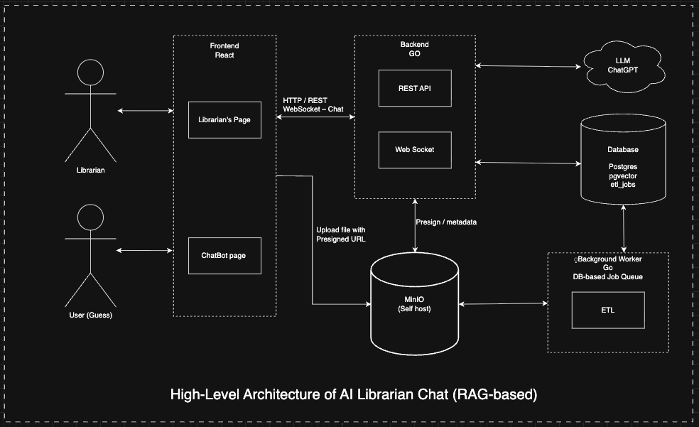

# High-Level Architecture of AI Librarian Chat (RAG-based)

## Architecture Diagram

## Components

### Frontend (React)

| Component | Description |
| --------- | ----------- |
| Librarian's Page | Upload books, view book list, edit metadata |
| ChatBot Page | Ask AI questions about books |

### Backend (Go)

| Component | Description |
| --------- | ----------- |
| REST API | Book management, metadata, presigned URL generation |
| WebSocket | Real-time chat streaming with LLM |

### Storage

| Component | Description |
| --------- | ----------- |
| MinIO | Self-hosted object storage for PDF files |
| Postgres + pgvector | Relational DB with vector search for embeddings |

### Background Worker (Go)

| Component | Description |
| --------- | ----------- |
| DB Job Queue | Poll ETL jobs from database |
| ETL | OCR → Chunking → Embedding pipeline |

### External Services

| Component | Description |
| --------- | ----------- |
| LLM (ChatGPT) | Generate answers from book content |

## Data Flow

1. **Book Upload**: Librarian → Librarian's Page → REST API (presigned URL) → MinIO
2. **ETL Processing**: Postgres (etl_jobs) → Job Queue → ETL → MinIO (read PDF) → Postgres (save chunks/embeddings)
3. **Chat**: Guest → ChatBot Page → WebSocket → LLM → Stream response
