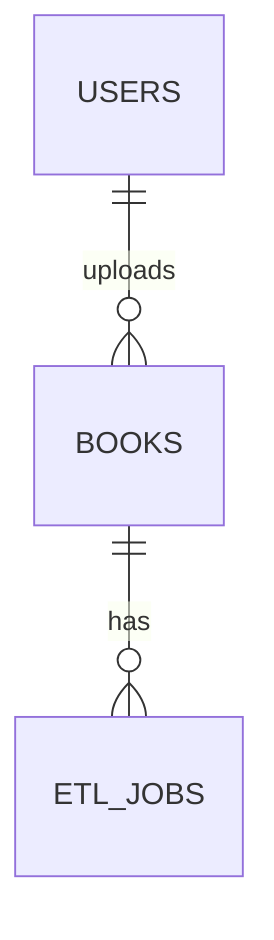
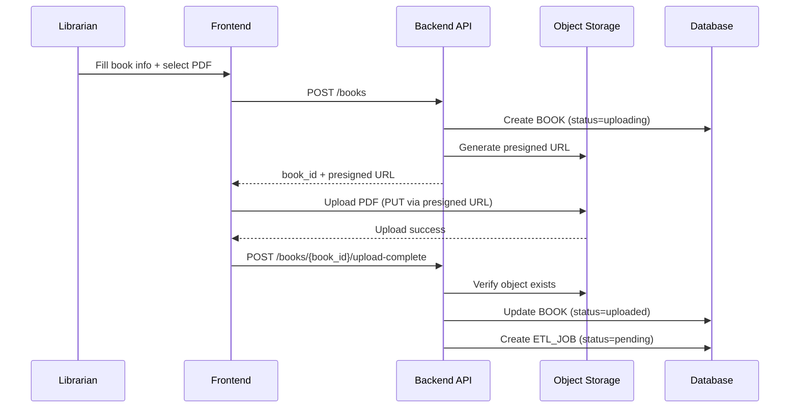

# LLD — User Story #1: Upload Book
## Sequence Diagram & API Specification

---

## ER diagram


## Sequence Diagram — Upload Book



---

## API Specification

### 1. Initialize Upload

**POST** `/books`

**Request**
```json
{
  "title": "Book Title",
  "file_name": "book.pdf",
  "file_size": 12345678,
  "content_type": "application/pdf"
}
```

**Behavior**
- Validate librarian permission
- Create BOOK record with status `uploading`
- Generate presigned upload URL

**Response**
```json
{
  "book_id": "uuid",
  "status": "uploading",
  "file_key": "books/uuid/original.pdf",
  "upload": {
    "presigned_url": "...",
    "method": "PUT",
    "expires_at": "2026-01-21T10:00:00Z"
  }
}
```

---

### 2. Upload Completion Callback

**POST** `/books/{book_id}/upload-complete`

**Request**
```json
{
  "file_key": "books/uuid/original.pdf"
}
```

**Behavior**
- Verify file exists in storage
- Update BOOK status to `uploaded`
- Create ETL_JOB with status `pending`

**Response**
```json
{
  "book_id": "uuid",
  "status": "uploaded"
}
```

---

### 3. Get Book Status

**GET** `/books/{book_id}`

**Response**
```json
{
  ... book's fields ...
}
```

---

## Notes & Constraints

- One PDF per book
- No file replacement after upload
- Upload completion callback must be idempotent
- ETL job starts only after upload verification
