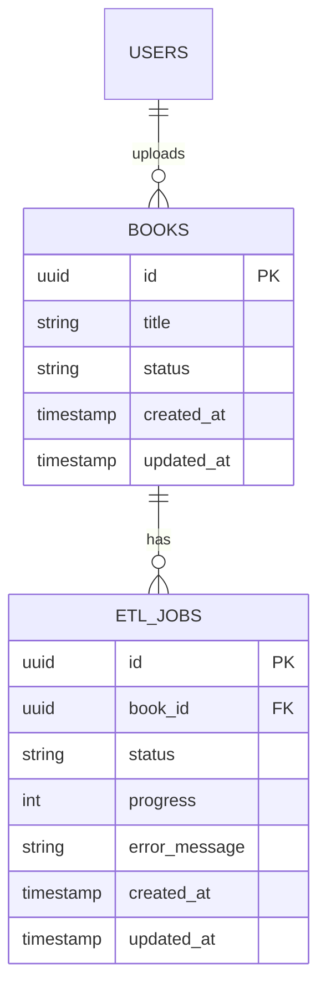
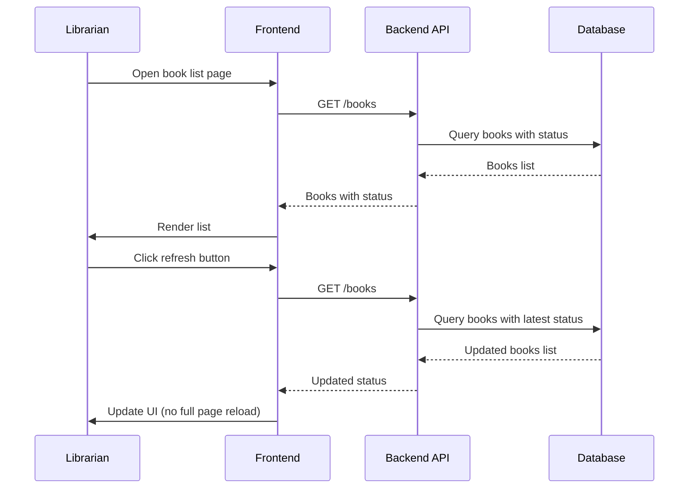
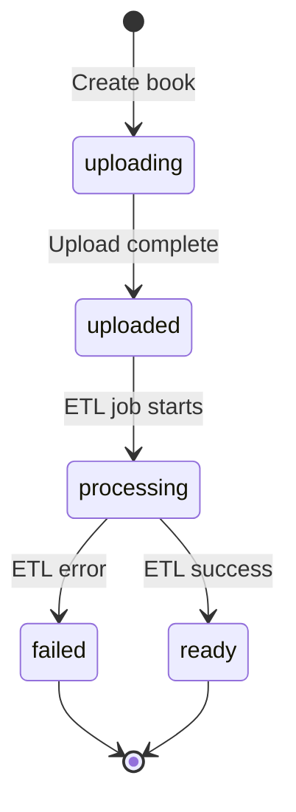

# LLD — User Story #2: View Uploaded Books
## Sequence Diagram & API Specification

---

## ER Diagram


## Sequence Diagram — View Uploaded Books



---

## API Specification

### 1. Get Books List

**GET** `/books`

**Query Parameters**
| Parameter | Type | Required | Description |
|-----------|------|----------|-------------|
| status | string | No | Filter by status (uploading, processing, ready, failed) |
| page | int | No | Page number (default: 1) |
| limit | int | No | Items per page (default: 20) |

**Behavior**
- Validate librarian permission
- Query books with optional status filter
- Include latest ETL job status for each book

**Response**
```json
{
  "data": [
    {
      "book_id": "uuid",
      "title": "Book Title",
      "status": "ready",
      "file_name": "book.pdf",
      "file_size": 12345678,
      "created_at": "2026-01-21T08:00:00Z",
      "updated_at": "2026-01-21T09:00:00Z",
      "etl_job": {
        "status": "completed",
        "progress": 100,
        "error_message": null
      }
    }
  ],
  "pagination": {
    "page": 1,
    "limit": 20,
    "total": 100,
    "total_pages": 5
  }
}
```

---

### 2. Get Single Book Detail

**GET** `/books/{book_id}`

**Behavior**
- Validate librarian permission
- Return book details with ETL job status

**Response**
```json
{
  "book_id": "uuid",
  "title": "Book Title",
  "status": "ready",
  "file_name": "book.pdf",
  "file_size": 12345678,
  "file_key": "books/uuid/original.pdf",
  "created_at": "2026-01-21T08:00:00Z",
  "updated_at": "2026-01-21T09:00:00Z",
  "etl_job": {
    "job_id": "uuid",
    "status": "completed",
    "progress": 100,
    "started_at": "2026-01-21T08:05:00Z",
    "completed_at": "2026-01-21T08:30:00Z",
    "error_message": null
  }
}
```

---

## Book Status Flow



---

## Notes & Constraints

- Status updates are triggered by explicit user refresh actions (no automatic polling)
- The system does not push updates to the client in real time
- Failed books are visually distinct in UI (e.g., red indicator)
- No edit or delete functionality in this story
- Pagination required for large book lists
