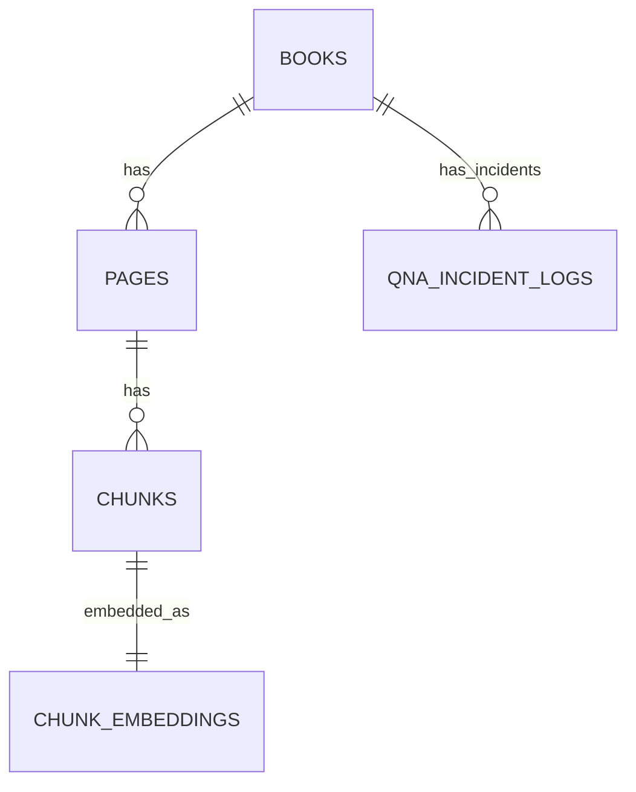
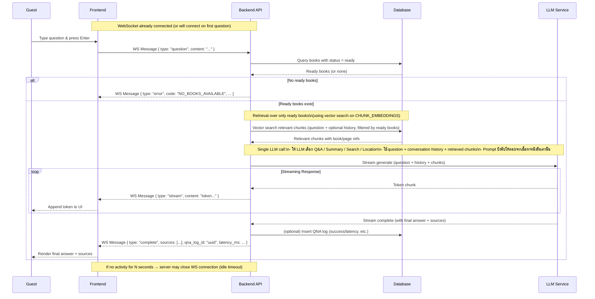

# LLD — User Story #3: Ask AI About Books

## Sequence Diagram & API Specification

---

## ER Diagram



---

## Sequence Diagram — WebSocket Q&A Flow



---

## WebSocket Specification

### 1. Connect to Chat

**WebSocket** `ws://host/ws/chat`

**Connection Behavior**

- Open connection when user sends first message
- Maintain connection for streaming responses
- Search across all books with status `ready`

**Connection Success Response**

```json
{
  "type": "connected",
  "session_id": "uuid"
}
```

---

### 2. Client Messages

#### Ask Question

```json
{
  "type": "question",
  "content": "What is machine learning?"
}
```

---

### 3. Server Messages

#### Streaming Token

```json
{
  "type": "stream",
  "content": "Machine learning is"
}
```

#### Stream Complete

```json
{
  "type": "complete",
  "qna_log_id": "uuid",
  "sources": [
    {
      "book_id": "uuid",
      "book_title": "Introduction to ML",
      "page_start": 45,
      "page_end": 45,
      "chunk_id": "uuid",
      "snippet": "...relevant text excerpt...",
      "relevance_score": 0.92
    },
    {
      "book_id": "uuid",
      "book_title": "Deep Learning Basics",
      "page_start": 12,
      "page_end": 13,
      "chunk_id": "uuid",
      "snippet": "...another relevant excerpt...",
      "relevance_score": 0.87
    }
  ],
  "latency_ms": 1250
}
```

#### Error

```json
{
  "type": "error",
  "code": "NO_RELEVANT_CONTENT",
  "message": "No relevant content found for your question"
}
```

---

### 4. Error Codes

| Code | Description |
| ---- | ----------- |
| NO_RELEVANT_CONTENT | No relevant chunks found |
| NO_BOOKS_AVAILABLE | No books with ready status |
| LLM_ERROR | LLM service error |
| INVALID_MESSAGE | Invalid message format |
| CONNECTION_TIMEOUT | WebSocket connection timeout |

---

## QNA_INCIDENT_LOGS Storage

**Purpose**: Log only negative feedback for improvement tracking

**Logged Data**

| Field | Description |
| ----- | ----------- |
| book_id | Reference to the book (from sources) |
| question_text | User's question |
| answer_text | Generated answer |
| feedback_text | User's negative feedback |
| latency_ms | Response generation time |
| created_at | Timestamp |

**Note**: Only logged when user submits negative feedback (thumbs down)

---

## Notes & Constraints

- Search across all books with status `ready`
- No book selection required - user just types and sends
- WebSocket opens on first message (Enter key)
- Streaming enables real-time token-by-token display
- Sources include book info (title, page) for reference
- If no relevant content found, return appropriate error message
- Questions outside book content scope return graceful fallback response
- โหมดการตอบ (Q&A, Summary, Search, Location) ถูกตัดสินใจโดย LLM จากคำถาม + context:
  - Backend ไม่รับ parameter `mode` จาก client
  - Backend ไม่ทำ LLM call แยกเพื่อ classify โหมด
  - การเลือกโหมดถูกควบคุมผ่าน system prompt ฝั่ง LLM (1 call ต่อคำถาม)
- หากไม่พบเนื้อหาที่เกี่ยวข้อง:
  - Backend ไม่ fallback ไปตอบความรู้ทั่วไปของ LLM
  - ต้องส่ง error `NO_RELEVANT_CONTENT` หรือข้อความ fallback ที่ระบุชัดว่าไม่มีเนื้อหาจากหนังสือ
