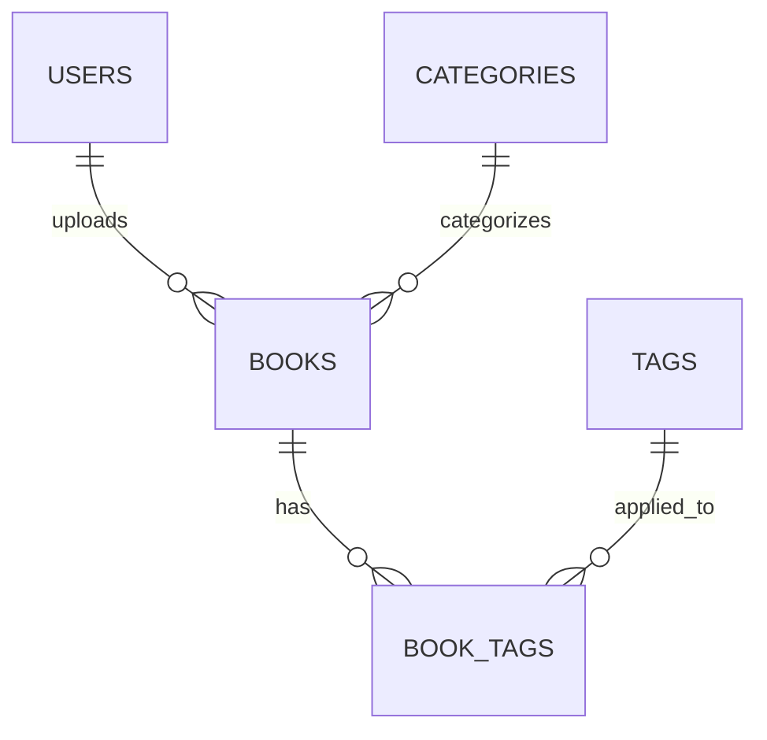
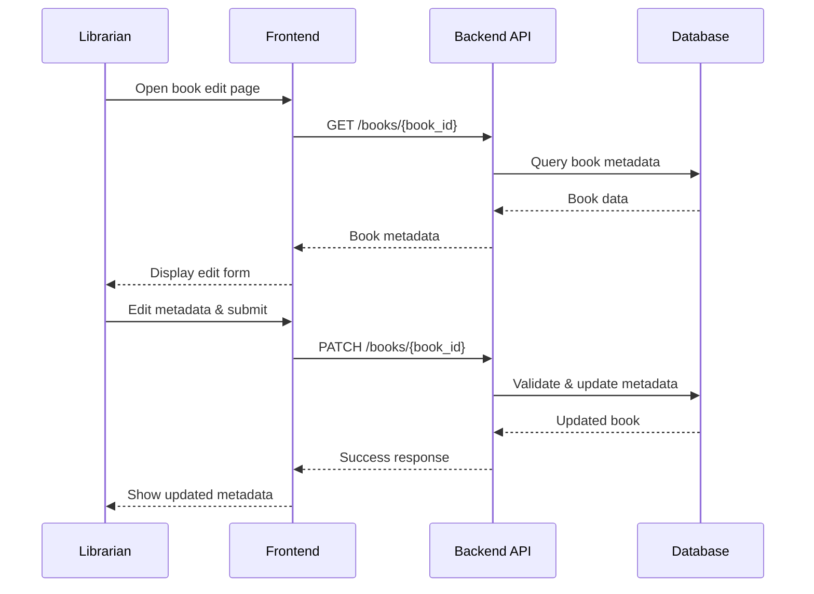

# LLD — User Story #4: Edit Book Metadata
## Sequence Diagram & API Specification

---

## ER Diagram


---

## Sequence Diagram — Edit Book Metadata



---

## API Specification

### 1. Get Book for Editing

**GET** `/books/{book_id}`

**Behavior**
- Validate librarian permission
- Return book metadata including tags and category

**Response**
```json
{
  "book_id": "uuid",
  "title": "Book Title",
  "status": "ready",
  "name": "book.pdf",
  "file_size": 12345678,
  "created_at": "2026-01-21T08:00:00Z",
  "updated_at": "2026-01-21T09:00:00Z"
}
```

---

### 2. Update Book Metadata

**PATCH** `/books/{book_id}`

**Request**
```json
{
  "title": "Updated Book Title",
  "description": "Updated description...",
  "category_id": "uuid",
  "tag_ids": ["uuid1", "uuid2", "uuid3"]
}
```

**Editable Fields**
| Field | Type | Description |
|-------|------|-------------|
| title | string | Book title |
| description | text | Book description |
| category_id | uuid | Category reference |
| tag_ids | array | List of tag IDs |

**Behavior**
- Validate librarian permission
- Validate category_id exists (if provided)
- Validate all tag_ids exist (if provided)
- Update only provided fields (partial update)
- Can update metadata regardless of current book status (uploading, uploaded, processing, ready, failed)
- **DO NOT** trigger ETL reprocessing
- **DO NOT** affect book status or embeddings

**Response**
```json
{
  "book_id": "uuid",
  "title": "Updated Book Title",
  "description": "Updated description...",
  "category": {
    "id": "uuid",
    "name": "Technology"
  },
  "tags": [
    {"id": "uuid", "name": "programming"},
    {"id": "uuid", "name": "python"},
    {"id": "uuid", "name": "beginner"}
  ],
  "status": "ready",
  "updated_at": "2026-01-21T10:30:00Z"
}
```

---

### 3. Get Available Categories

**GET** `/categories`

**Response**
```json
{
  "data": [
    {"id": "uuid", "name": "Technology"},
    {"id": "uuid", "name": "Science"},
    {"id": "uuid", "name": "Literature"}
  ]
}
```

---

### 4. Get Available Tags

**GET** `/tags`

**Query Parameters**
| Parameter | Type | Required | Description |
|-----------|------|----------|-------------|
| search | string | No | Filter tags by name |

**Response**
```json
{
  "data": [
    {"id": "uuid", "name": "programming"},
    {"id": "uuid", "name": "python"},
    {"id": "uuid", "name": "machine-learning"}
  ]
}
```

---

## Notes & Constraints

- Metadata edit does NOT require re-uploading PDF file
- Metadata edit does NOT trigger ETL reprocessing
- Metadata edit does NOT regenerate embeddings
- Updated metadata is immediately reflected in:
  - Book list view
  - Book detail view
- Only librarians can edit metadata
- File-related fields (file_name, file_size, file_key) are read-only
