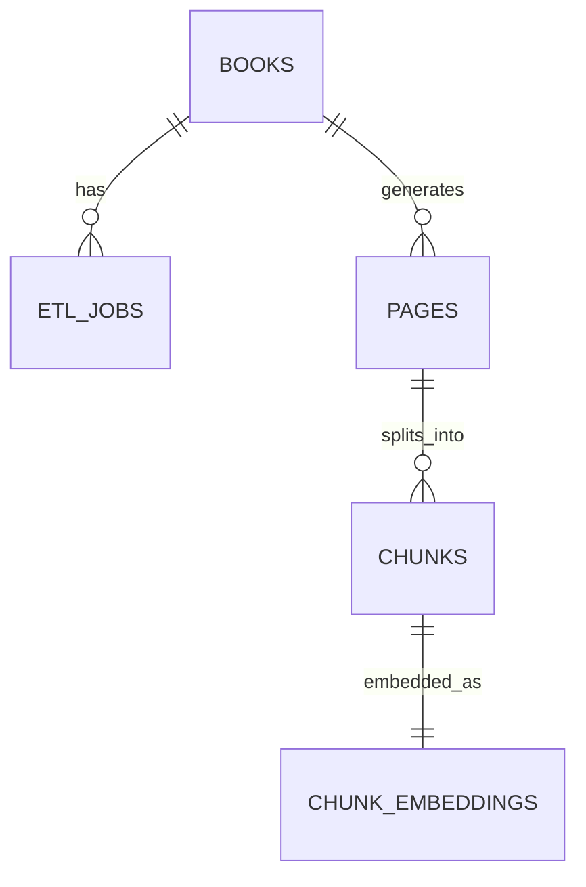
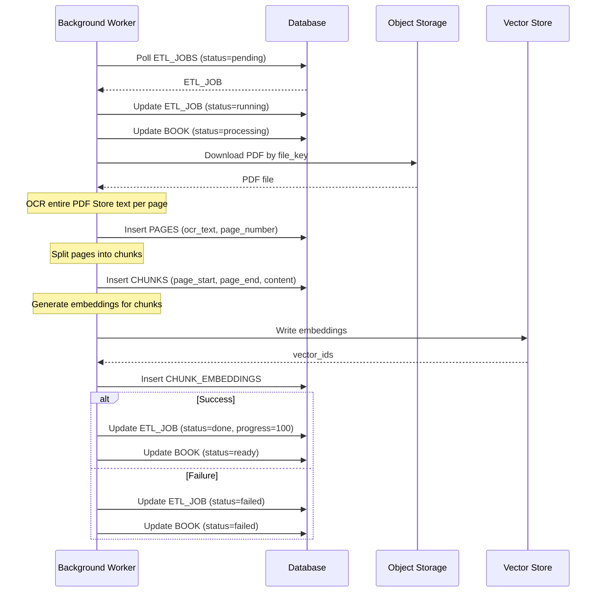

# LLD — User Story #5: Background Worker (ETL Processing)
## Sequence Diagram & API Specification

---

## ER diagram

## Sequence Diagram — Background Processing (ETL)

---

## Worker Behavior Specification

### Job Pickup Rules
- Worker must pick only ETL_JOBS with status `pending`
- Job selection must be atomic to avoid duplicate processing
- One ETL_JOB is processed by only one worker at a time

### Processing Steps
1. Download PDF from object storage
2. Perform OCR on entire document
3. Store OCR results per page
4. Split pages into chunks
5. Generate embeddings for each chunk
6. Persist embeddings and metadata
7. Update job and book status

### Progress Reporting
- Worker must update `ETL_JOBS.progress` periodically
- Progress represents overall ETL completion percentage
- Progress values must be monotonic (never decrease)

### Error Handling
- Any unrecoverable error marks:
  - `ETL_JOBS.status = failed`
  - `BOOKS.status = failed`
- Error details must be stored in `ETL_JOBS.error_message`
- Partial results may remain for debugging

---

## Constraints & Assumptions

- Worker operates asynchronously and independently from API requests
- OCR, chunking, and embedding are executed offline
- Worker does not accept direct external requests
- Retry strategy (manual or automatic) is out of scope for this user story
