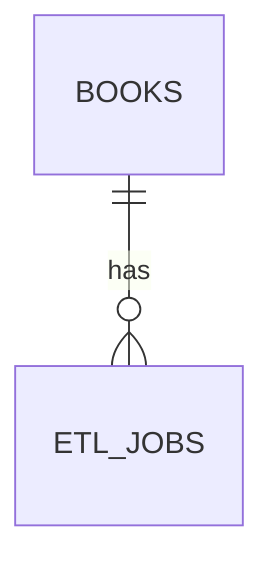
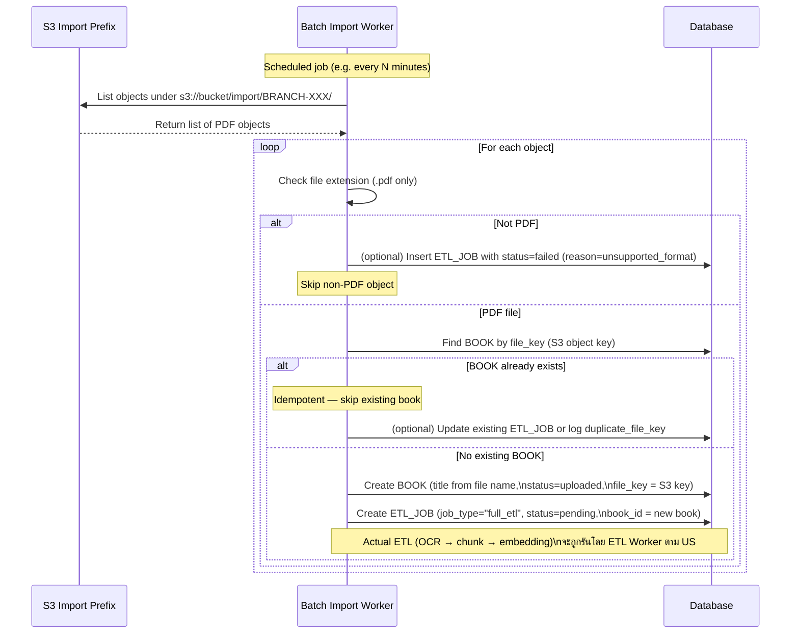

# LLD — User Story #6: Batch Import from Folder
## Sequence Diagram & API / Worker Specification

---

## ER Diagram (Relevant Entities)

---

## Sequence Diagram — Folder-based Batch Import

---

## Worker Responsibilities
- Scan import folder on schedule
- Accept only `.pdf` files
- Detect duplicate file names
- Create BOOK + ETL_JOB per file
- Execute ETL independently per file
- Ensure idempotency (file processed once)

---

## Notes & Constraints
- File name is the source of initial book title
- Duplicate file names are rejected
- Processing order is not guaranteed
- Worker must be resilient to partial failures
- Metadata refinement is handled separately via US#4
