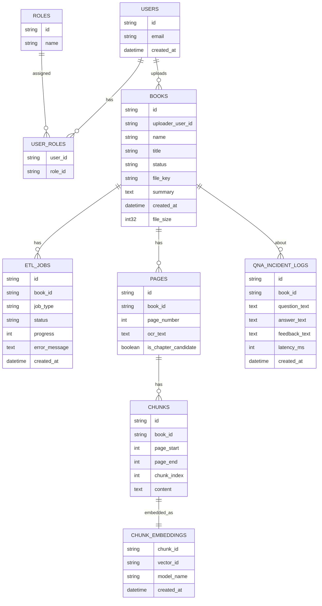

```mermaid
erDiagram
    USERS ||--o{ USER_ROLES : has
    ROLES ||--o{ USER_ROLES : assigned

    USERS ||--o{ BOOKS : uploads

    BOOKS ||--o{ ETL_JOBS : has
    BOOKS ||--o{ PAGES : has
    PAGES ||--o{ CHUNKS : has
    CHUNKS ||--|| CHUNK_EMBEDDINGS : embedded_as

    BOOKS ||--o{ QNA_INCIDENT_LOGS : about


    USERS {
      string  id
      string  email
      datetime created_at
    }

    ROLES {
      string  id
      string  name
    }

    USER_ROLES {
      string  user_id
      string  role_id
    }

    BOOKS {
      string  id
      string  uploader_user_id
      string  name
      string  title
      string  status 
      string  file_key     
      text    summary      
      datetime created_at
      int32 file_size 
    }

    ETL_JOBS {
      string  id
      string  book_id
      string  job_type     
      string  status      
      int     progress    
      text    error_message
      datetime created_at
    }

    PAGES {
      string  id
      string  book_id
      int     page_number
      text    ocr_text
      boolean is_chapter_candidate
    }

    CHUNKS {
      string  id
      string  book_id
      int     page_start  
      int     page_end    
      int     chunk_index 
      text    content
    }

    CHUNK_EMBEDDINGS {
      string  chunk_id    
      string  vector_id   
      string  model_name
      datetime created_at
    }

    QNA_INCIDENT_LOGS {
      string  id
      string  book_id
      text    question_text
      text    answer_text
      text    feedback_text
      int     latency_ms   
      datetime created_at
    }
```